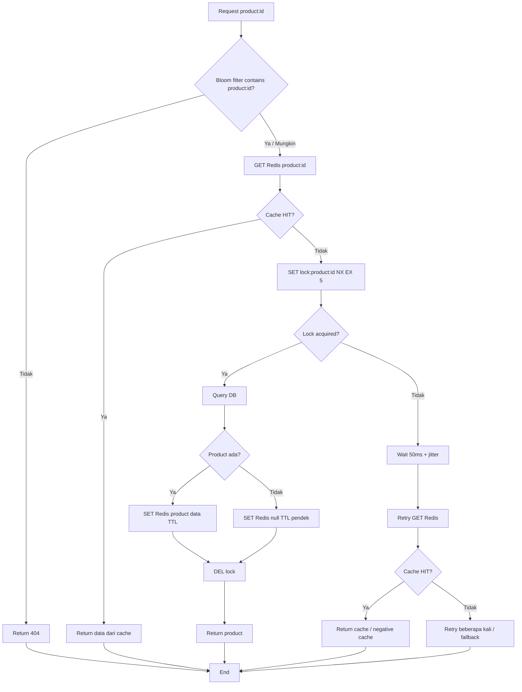

```mermaid
flowchart TD
    A[Request product:id] --> B{Bloom filter contains product:id?}

    B -->|Tidak| C[Return 404]
    C --> Z[End]

    B -->|Ya / Mungkin| D[GET Redis product:id]
    D --> E{Cache HIT?}

    E -->|Ya| F[Return data dari cache]
    F --> Z

    E -->|Tidak| G[SET lock:product:id NX EX 5]
    G --> H{Lock acquired?}

    H -->|Ya| I[Query DB]
    I --> J{Product ada?}

    J -->|Ya| K[SET Redis product data TTL]
    K --> L[DEL lock]
    L --> M[Return product]
    M --> Z

    J -->|Tidak| N[SET Redis null TTL pendek]
    N --> L

    H -->|Tidak| O[Wait 50ms + jitter]
    O --> P[Retry GET Redis]
    P --> Q{Cache HIT?}

    Q -->|Ya| R[Return cache / negative cache]
    R --> Z

    Q -->|Tidak| S[Retry beberapa kali / fallback]
    S --> Z
```
