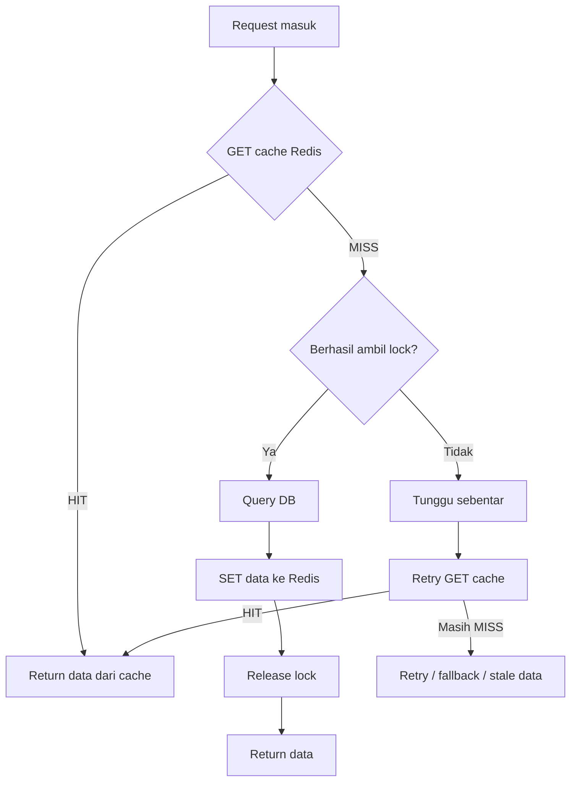

```mermaid
flowchart TD
    A[Request masuk] --> B{GET cache Redis}
    B -->|HIT| C[Return data dari cache]
    B -->|MISS| D{Berhasil ambil lock?}

    D -->|Ya| E[Query DB]
    E --> F[SET data ke Redis]
    F --> G[Release lock]
    G --> H[Return data]

    D -->|Tidak| I[Tunggu sebentar]
    I --> J[Retry GET cache]
    J -->|HIT| C
    J -->|Masih MISS| K[Retry / fallback / stale data]
```
