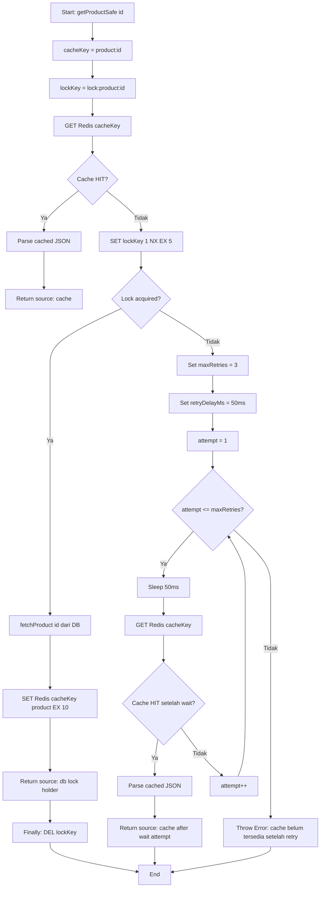

```mermaid
flowchart TD
    A[Start: getProductSafe id] --> B[cacheKey = product:id]
    B --> C[lockKey = lock:product:id]

    C --> D[GET Redis cacheKey]
    D --> E{Cache HIT?}

    E -->|Ya| F[Parse cached JSON]
    F --> G[Return source: cache]

    E -->|Tidak| H[SET lockKey 1 NX EX 5]
    H --> I{Lock acquired?}

    I -->|Ya| J[fetchProduct id dari DB]
    J --> K[SET Redis cacheKey product EX 10]
    K --> L[Return source: db lock holder]
    L --> M[Finally: DEL lockKey]
    M --> N[End]

    I -->|Tidak| O[Set maxRetries = 3]
    O --> P[Set retryDelayMs = 50ms]
    P --> Q[attempt = 1]

    Q --> R{attempt <= maxRetries?}

    R -->|Ya| S[Sleep 50ms]
    S --> T[GET Redis cacheKey]
    T --> U{Cache HIT setelah wait?}

    U -->|Ya| V[Parse cached JSON]
    V --> W[Return source: cache after wait attempt]
    W --> N

    U -->|Tidak| X[attempt++]
    X --> R

    R -->|Tidak| Y[Throw Error: cache belum tersedia setelah retry]
    Y --> N
```
